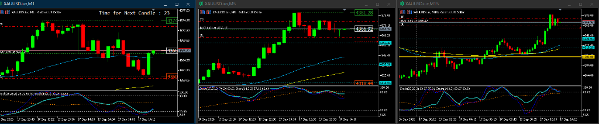
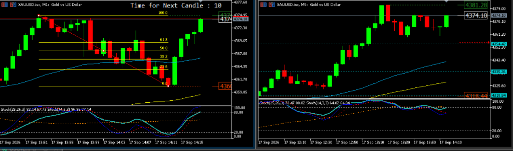
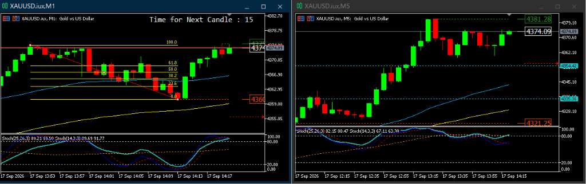
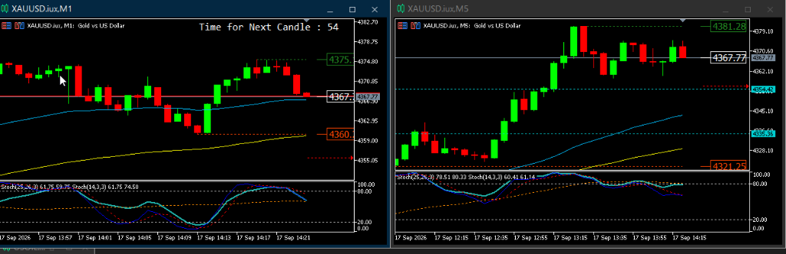
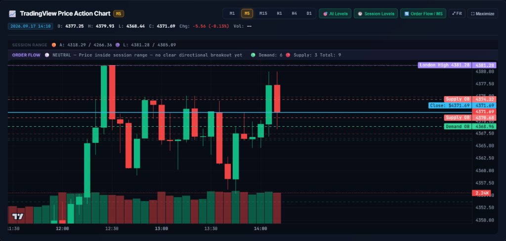
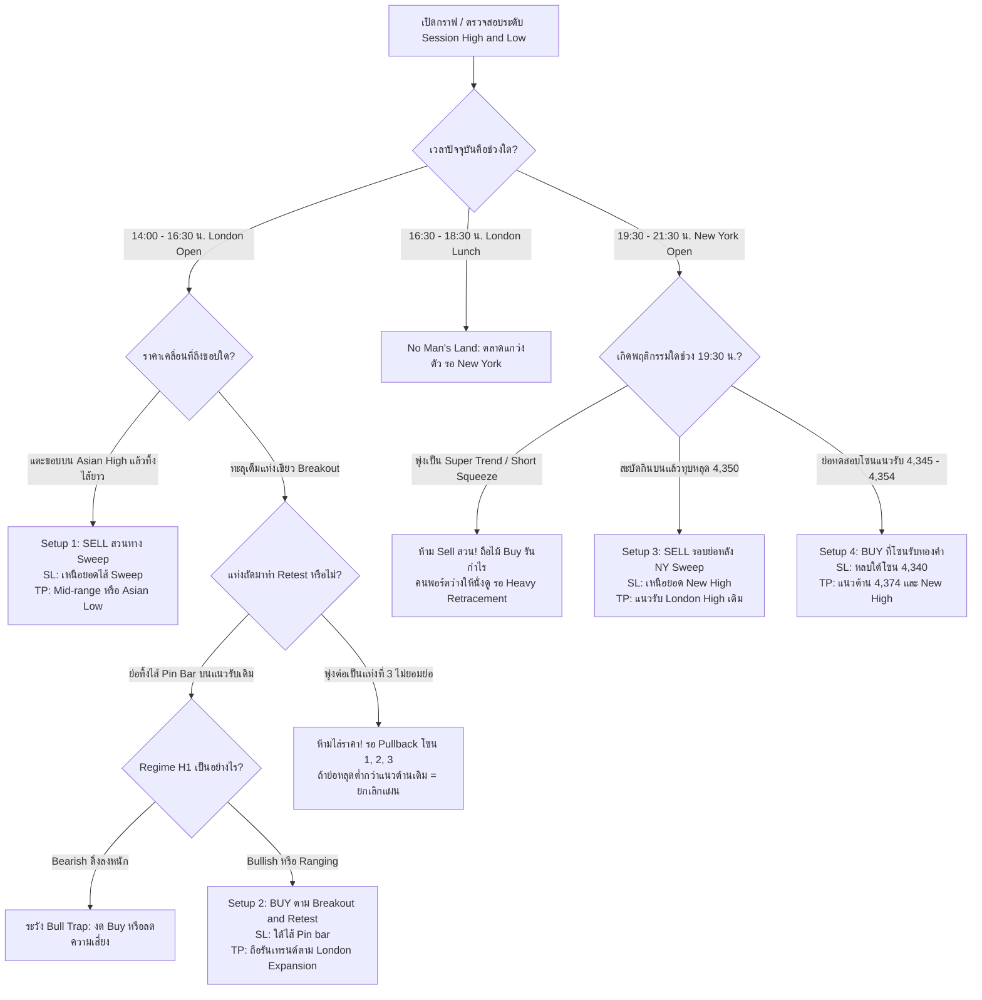

# คู่มือกลยุทธ์การเทรด: Session Range, Liquidity Hunting, Breakout & Retest และ Multi-Timeframe Confluence

> **หมวดหมู่:** Market Microstructure, Scalping & Intraday Strategy (M1/M5/M15/H1)  
> **สินทรัพย์ที่ใช้:** XAUUSD (Gold) & Forex Major Pairs  
> **เวอร์ชัน:** 5.0 (อัปเดตสมบูรณ์: เพิ่มเจาะลึก Order Flow, Supply Order Block, Mean Threshold / Fibo 50-61.8% และกลไก Liquidity Cycle & Short Squeeze พร้อมภาพประกอบหน้างานจริง)  
> **เอกสารอ้างอิง:** MQL5 Vibe Coding / AI Gold Scalper System  

---

## สารบัญ
1. [บทนำ: แก่นแท้ของพฤติกรรมราคาและเวลา (Time & Price)](#1-บทนำ-แก่นแท้ของพฤติกรรมราคาและเวลา-time--price)
2. [ทำไม Session High/Low จึงมีประสิทธิภาพสูงมากในเชิงสถาบัน?](#2-ทำไม-session-highlow-จึงมีประสิทธิภาพสูงมากในเชิงสถาบัน)
3. [กรอบเวลาและกลไก Fixed Cut-off Window (เวลาไทย ICT UTC+7)](#3-กรอบเวลาและกลไก-fixed-cut-off-window-เวลาไทย-ict-utc7)
4. [การเปรียบเทียบ: Session High/Low vs แนวรับแนวต้านสำคัญ (Key S/R)](#4-การเปรียบเทียบ-session-highlow-vs-แนวรับแนวต้านสำคัญ-key-sr)
5. [การจำแนกแท่งเทียน: Liquidity Sweep vs Genuine Breakout](#5-การจำแนกแท่งเทียน-liquidity-sweep-vs-genuine-breakout)
6. [เจาะลึกลำดับ 3 แท่งเทียน (Candle Sequence) และข้อผิดพลาดเรื่อง Timing](#6-เจาะลึกลำดับ-3-แท่งเทียน-candle-sequence-และข้อผิดพลาดเรื่อง-timing)
7. [จุดกลับตัวของคลื่น Pullback และกฎโครงสร้างพัง (Structural Invalidation)](#7-จุดกลับตัวของคลื่น-pullback-และกฎโครงสร้างพัง-structural-invalidation)
8. [การนำ Regime (H1 vs M15) มาคัดเกรด Setup (Filter Matrix)](#8-การนำ-regime-h1-vs-m15-มาคัดเกรด-setup-filter-matrix)
9. [พฤติกรรมช่วงรอยต่อระหว่างเซสชัน: London Lunch & Pre-New York Consolidation](#9-พฤติกรรมช่วงรอยต่อระหว่างเซสชัน-london-lunch--pre-new-york-consolidation)
10. [สภาวะ Parabolic Super Trend & ปรากฏการณ์ Short Squeeze](#10-สภาวะ-parabolic-super-trend--ปรากฏการณ์-short-squeeze)
11. [3 Scenarios สำคัญช่วงเปิดตลาด New York (19:30 น.) และกฎ 10 นาที](#11-3-scenarios-สำคัญช่วงเปิดตลาด-new-york-1930-น-และกฎ-10-นาที)
12. [จิตวิทยา "ทำไมถึงไม่มีหน้า SELL" และ 3 สเต็ปยืนยันก่อนคิดจะสวนเทรนด์](#12-จิตวิทยา-ทำไมถึงไม่มีหน้า-sell-และ-3-สเต็ปยืนยันก่อนคิดจะสวนเทรนด์)
13. [กรณีศึกษาจริงหน้างาน (Live Case Study): จากจุดเข้า M5 Pinbar สู่ TP ที่ 4,374 และบทเรียน Double Top Rejection](#13-กรณีศึกษาจริงหน้างาน-live-case-study-จากจุดเข้า-m5-pinbar-สู่-tp-ที่-4374-และบทเรียน-double-top-rejection)
14. [เจาะลึก Order Flow & SMC: กายวิภาคของ Supply Order Block, Mean Threshold (Fibo 50–61.8%) และวัฏจักรล่าสภาพคล่อง (The Smart Money Liquidity Cycle)](#14-เจาะลึก-order-flow--smc-กายวิภาคของ-supply-order-block-mean-threshold-fibo-50618-และวัฏจักรล่าสภาพคล่อง-the-smart-money-liquidity-cycle)
15. [The Ultimate Hybrid: การผสานพลังระหว่าง Session Sweep กับ Key S/R](#15-the-ultimate-hybrid-การผสานพลังระหว่าง-session-sweep-กับ-key-sr)
16. [กฎเหล็กและ Rules of Engagement สำหรับการเทรด](#16-กฎเหล็กและ-rules-of-engagement-สำหรับการเทรด)
17. [Decision Matrix: สรุปผังการตัดสินใจหน้างาน (Master Flowchart)](#17-decision-matrix-สรุปผังการตัดสินใจหน้างาน-master-flowchart)

---

## 1. บทนำ: แก่นแท้ของพฤติกรรมราคาและเวลา (Time & Price)

ในตลาดการเงินระดับสถาบัน การเคลื่อนไหวของราคาไม่ได้เกิดจากรูปแบบแท่งเทียนลอยๆ เพียงอย่างเดียว แต่ถูกขับเคลื่อนด้วย **2 องค์ประกอบหลัก**:
1. **เวลา (Time):** รอบกะการทำงานของศูนย์กลางการเงินโลก (Tokyo/Sydney → London → New York)
2. **สภาพคล่อง (Liquidity):** คำสั่ง Stop Loss และ Pending Orders ที่ผู้เล่นรายย่อย (Retail Traders) วางกระจุกตัวอยู่ในแต่ละช่วงเวลา

เมื่อเข้าใจสองสิ่งนี้ เราจะสามารถแบ่งกลยุทธ์การเทรดออกเป็น 2 โหมดที่ชัดเจน:
* **โหมดที่ 1: Trend Alignment (เทรดตามเทรนด์ใหญ่):** เมื่อ Timeframe ใหญ่ (H1/M15) สอดคล้องกันชัดเจน → ใช้ **แนวรับแนวต้านสำคัญ (Key S/R / FVG / Order Block)** เพื่อหาจังหวะ Buy the Dip / Sell the Rally
* **โหมดที่ 2: Session Scalper (ล่าสภาพคล่องหรือเทรดระเบิดกรอบ):** เมื่อ H1/M15 เป็นไซด์เวย์ หรือในช่วงชั่วโมงแรกของการเปิดตลาด (14:00 น. หรือ 19:30 น.) → ใช้ **Session High/Low** เล่นรอบ Liquidity Sweep หรือ Breakout & Retest

---

## 2. ทำไม Session High/Low จึงมีประสิทธิภาพสูงมากในเชิงสถาบัน?

Session High/Low โดยเฉพาะ **Asian High/Low (AH/AL)** ไม่ใช่แนวต้านหรือแนวรับตามธรรมชาติทั่วไป แต่เป็น **"สระน้ำสภาพคล่อง" (Liquidity Pool)** ด้วยเหตุผล 3 ประการ:

### 2.1 การเปลี่ยนกะของสถาบันการเงิน (Institutional Shift)
ตลาดเปิดตลอด 24 ชั่วโมง แต่เม็ดเงินของธนาคารพาณิชย์และกองทุนยักษ์ใหญ่ไม่ได้เข้าพร้อมกันทั้งวัน เมื่อเทรดเดอร์ในลอนดอน (14:00 น. ไทย) หรือนิวยอร์ก (19:30 น. ไทย) เปิดโต๊ะเทรด สิ่งแรกที่ระบบและอัลกอริทึมจะตรวจจับคือ:
> *"ตั้งแต่เปิดวันมา ราคาวิ่งไปสูงสุดที่ไหน ต่ำสุดที่ไหน และมีคำสั่งซื้อขายรอให้จับคู่ (Match Orders) ตรงจุดไหนมากที่สุด?"*

### 2.2 จุดรวม Stop Loss ของเทรดเดอร์ทั่วโลก
* ผู้เล่นที่เปิดคำสั่ง **SELL** ในช่วงเช้า จะตั้ง Stop Loss ไว้ **เหนือยอด Asian High**
* ผู้เล่นที่เปิดคำสั่ง **BUY** ในช่วงเช้า จะตั้ง Stop Loss ไว้ **ใต้ฐาน Asian Low**
* Breakout Trader วางคำสั่ง Buy Stop / Sell Stop ไว้เพื่อหวังตามราคาทะลุกรอบ

เมื่อราคาถูกผลักดันขึ้นไปทะลุ Asian High คำสั่ง Stop Loss ของฝั่ง Sell (ซึ่งก็คือคำสั่ง Buy Market) และคำสั่ง Buy Stop จะถูกทำงานพร้อมกัน ทำให้เกิด **สภาพคล่องมหาศาล (Massive Liquidity)** ให้กับสถาบันการเงินใช้จับคู่ออเดอร์ขนาดใหญ่

### 2.3 ความเป็นหนึ่งเดียวระดับสากล (100% Objective)
แนวรับแนวต้านตามสายตา (Subjective S/R) แต่ละคนอาจลากไม่เหมือนกัน ขึ้นอยู่กับ Indicator หรือมุมมอง Trendline แต่ **Asian High และ Asian Low คือตัวเลขราคาจุดทศนิยมเดียวกันเป๊ะบนหน้าจอเทรดเดอร์ทั่วโลก** จึงไม่มีไบแอสทางสายตา

---

## 3. กรอบเวลาและกลไก Fixed Cut-off Window (เวลาไทย ICT UTC+7)

เพื่อแก้ปัญหาการคาบเกี่ยวกันของตลาดและป้องกันไม่ให้กรอบขยายตัวจนสับสน ระบบจึงใช้ **Fixed Cut-off Window** ที่ล็อคค่าตายตัวก่อนตลาดถัดไปเปิด:

```
00:00        07:00               13:30  14:00               19:30  20:00        24:00
  │            │                   │      │                   │      │            │
  └────────────┴─────────▲─────────┴──────┴─────────▲─────────┴──────┴──────▲─────┘
                   ASIAN RANGE                  LONDON RANGE             NEW YORK
               (07:00 – 13:30 น.)          (14:00 – 19:30 น.)         (19:30 น.+)
                  [ ล็อคที่ 13:30 ]           [ ล็อคที่ 19:30 ]
```

### รายละเอียดของแต่ละกรอบ:
1. 🟠 **Asian Range (07:00 – 13:30 น. เวลาไทย):**
   * **พฤติกรรม:** ตลาดเอเชียมักมีโวลุ่มต่ำกว่าและสร้างกรอบสะสมราคา (Accumulation)
   * **การล็อคค่า:** ล็อค High และ Low เมื่อถึงเวลา **13:30 น.** เพื่อนำระดับราคานี้ไปใช้เป็นแนวอ้างอิงให้ตลาดลอนดอนทดสอบ
2. 🟣 **London Range (14:00 – 19:30 น. เวลาไทย):**
   * **พฤติกรรม:** โวลุ่มจากยุโรปทะลักเข้ามา มักเกิดการขยายกรอบ หรือกวาดกรอบเอเชีย (Manipulation / Expansion)
   * **การล็อคค่า:** ล็อค High และ Low เมื่อถึงเวลา **19:30 น.** เพื่อนำไปให้ตลาดนิวยอร์กใช้ทดสอบต่อไป

---

## 4. การเปรียบเทียบ: Session High/Low vs แนวรับแนวต้านสำคัญ (Key S/R)

| มิติการวิเคราะห์ | Session High / Low (กรอบเวลา) | Key Support / Resistance (โครงสร้างราคา) |
| :--- | :--- | :--- |
| **นิยาม** | ราคาสูงสุด-ต่ำสุดในแต่ละกะเวลา | ยอดสวิงเดิมใน H1/H4, Order Block, FVG, โซนดีมานด์/ซัพพลาย |
| **ความเป็นรูปธรรม** | **แน่นอน 100% (Objective)** ทุกคนเห็นตัวเลขเดียวกัน | **ขึ้นกับมุมมอง (Subjective)** แต่ละคนตีเส้นต่างกัน |
| **บทบาทหลัก** | เป็น **"แม่เหล็กดูดสภาพคล่อง" (Liquidity Magnet)** ราคามักวิ่งเข้าหาเพื่อกวาดออเดอร์ | เป็น **"กำแพงกั้นทิศทาง" (Barrier Zone)** ที่ราคามักชะลอหรือดีดตัว |
| **พฤติกรรมราคา** | มักจะ **ทะลุก่อนแล้วค่อยดึงกลับ** (Sweep & Trap) | มักจะ **ทดสอบแล้วเด้งกลับ** หรือหากหลุดจะเปลี่ยนเทรนด์ |
| **ความเหมาะสมของสไตล์** | **Scalping (M1/M5)**, จังหวะเปิดตลาด (14:00, 19:30 น.) | **Day Trade / Swing Trade (M15/H1/H4)**, เล่นตามเทรนด์ |

---

## 5. การจำแนกแท่งเทียน: Liquidity Sweep vs Genuine Breakout

เมื่อราคาเดินทางมาถึงเส้น Asian High หรือ Asian Low จะเกิด 1 ใน 2 สถานการณ์นี้เสมอ:

```
    [ กรณีที่ 1: Liquidity Sweep (กับดักหลอก) ]         [ กรณีที่ 2: Genuine Breakout (ทะลุจริง) ]

              ▲ ไส้ยาวกวาด Stop Loss                             ▲ ยอด High ใหม่
              │                                                 ┌──┐
      ────────┼──────────────── Asian High              ────────┼──┼── Asian High
              │                                                 │  │ █ เนื้อเทียนตันขนาดใหญ่
              █ เนื้อเทียนทิ้งตัวปิด "ใต้เส้น"                  └──┘   (Marubozu / Full Body)
              │ (Shooting Star / Pinbar)                               ปิด "ยืนเหนือเส้น" ชัดเจน
```

### 5.1 สัญญาณบ่งชี้ Liquidity Sweep (กับดักล่อซื้อ / Judas Swing)
* **ไส้เทียนด้านบน (Upper Wick) ยาวอย่างเด่นชัด:** ราคาพุ่งผ่านเส้นไปเพียงชั่วคราวเพื่อกิน Stop Loss แล้วถูกเทขายสวนกลับทันที
* **เนื้อเทียน (Body) ปิดต่ำกว่าแนว:** แท่งเทียนไม่สามารถปิดยืนเหนือเส้นได้ หรือแท่งถัดมาทิ้งตัวแดงกลืนกิน (Bearish Engulfing) รูดกลับเข้ามากรอบ
* **ทฤษฎีแท่งชั่วโมง (H1):** แม้ M5/M15 จะปิดเขียวชั่วคราว แต่เมื่อปิดแท่งชั่วโมง (15:00 น.) แท่ง H1 จะกลายเป็น **Shooting Star** ทิ้งไส้ยาวเหนือกราฟ

### 5.2 สัญญาณบ่งชี้ Genuine Breakout (การระเบิดกรอบขึ้นจริง)
* **แท่งโมเมนตัมเนื้อตัน (Bullish Marubozu):** เนื้อเทียนสีเขียวขนาดใหญ่ ไส้บนสั้นมาก (< 1 ดอลลาร์)
* **การปิดแท่งเหนือแนว (Close Acceptance):** เนื้อเทียนปิดยืนเหนือ Asian High ชัดเจน (เช่น ทะลุเกิน 3–5 ดอลลาร์ขึ้นไป)
* **พฤติกรรม:** ตลาดยอมรับมูลค่าใหม่ (Price Acceptance) เหนือกรอบเอเชีย

---

## 6. เจาะลึกลำดับ 3 แท่งเทียน (Candle Sequence) และข้อผิดพลาดเรื่อง Timing

บทเรียนสำคัญของ Scalper คือ **"การแยกให้ออกระหว่างจุดเข้า (Entry) กับจุดที่ราคาพุ่งจบคลื่นไปแล้ว (Expansion)"**:

```
                                               ┌──┐ แท่งที่ 3: Expansion (4,329)
                                               │  │ [เพิ่งมาเห็นตรงนี้ = ช้าไป 1 แท่ง!]
                              ┌──┐             │  │ ❌ ห้ามไล่ราคาเด็ดขาด!
                              │  │ 4,324       │  │
                              └──┘             └──┘
            ┌──┐                │ ไส้ล่าง (Pin Bar)
            │  │                ▼ เด้งรับแนวต้านเดิม
 ───────────┼──┼────────────────┼──────────────────── Asian High (4,318)
            └──┘
          แท่งที่ 1            แท่งที่ 2                แท่งที่ 3
         (Breakout)        (Retest & Pin Bar)          (Expansion)
                          👉 [จุดเข้า BUY ที่ถูก]     💰 [จุดแบ่งปิดกำไรของคนรอบแรก]
```

### 6.1 ลำดับ 3 แท่งเทียนหน้างาน:
1. **แท่งที่ 1 (Breakout Candle):** แท่งเขียวแท่งแรกที่พุ่งทะลุ Asian High ขึ้นไปทำยอด (เช่น ขึ้นไปแตะ 4,323.50)
2. **แท่งที่ 2 (Retest & Pin Bar Candle):**
   * ราคาย่อตัวลงมาทิ้งไส้ล่างทดสอบแนวรับ Asian High แล้วดีดกลับปิดเป็นแท่งเขียว/Pin Bar แถว **4,324.xx**
   * 🌟 **นี่คือ Optimal Entry Point (จุดเข้าที่สมบูรณ์แบบที่สุด):** จุดที่ต้องกด BUY ทันทีพร้อมวาง **SL ใต้ไส้ Pin Bar ที่ 4,320.00 (เสี่ยงเพียง 4 ดอลลาร์)**
3. **แท่งที่ 3 (Expansion Candle):**
   * ผลลัพธ์ของการส่งแรงจากแท่ง Pin Bar ทำให้ราคาพุ่งขึ้นไปปิดที่ **4,329.xx**
   * **คำเตือน:** ใครที่เพิ่งมากด BUY หลังปิดแท่งที่ 3 นี้ คือคนที่ **"มาช้าไป 1 แท่ง (Late by 1 Bar)"**

### 6.2 การถือรันเทรนด์ (Runners) vs จิตวิทยาของคนไล่ราคา:
* **คนที่ Buy จากแท่งที่ 2 (ต้นทุน 4,324):** 
  * ถือรันเทรนด์ต่อได้สบายใจ! เมื่อราคาพุ่งถึง 4,329–4,330 สามารถ **แบ่งปิด 50% (Partial Close)** เก็บกำไรเข้ากระเป๋า แล้วเลื่อน SL มาบังทุนที่ 4,324.50 (กลายเป็น Risk-Free Trade ทันที)
* **คนที่เพิ่งมา Buy ที่แท่งที่ 3 (ต้นทุน 4,329):**
  * เมื่อราคาชนแนวต้านจิตวิทยา 4,330 แล้วย่อตัวตามธรรมชาติลงมาพักฐานที่ 4,326 คนที่ Buy ยอดจะ **พอร์ตติดลบ -$3 ทันที** และเกิดความเครียดจนเผลอกดคัทลอสที่ก้นหลุม

---

## 7. จุดกลับตัวของคลื่น Pullback และกฎโครงสร้างพัง (Structural Invalidation)

หากราคาพุ่งขึ้นไปทำ New High แล้วเริ่มย่อตัวพักฐาน ระดับราคาที่ต้องจับตามองเป็น **"จุดกลับตัวเด้งขึ้นต่อ"** มี 3 โซน:

```
                       ▲ ปลายคลื่น (4,330 – 4,335)
                         │ 🔻 เริ่มเกิดการย่อตัว (Pullback)
                         │
 [โซนที่ 1: ย่อตื้น]     ├── 4,323.50 – 4,325.00  (ยอด High ของแท่งแรก / Minor Flip Zone)
                         │
 [โซนที่ 2: โซนทองคำ]   ├── 4,320.00 – 4,322.00  (ฐานไส้ Pin Bar เดิม + Fibo 50-61.8%)
                         │
 [โซนที่ 3: ด่านสุดท้าย] ├── 4,318.00 – 4,318.50  (เส้น Asian High / Ultimate Support)
                         │
                      ───┴── 🛑 หลุด 4,316.50 = โครงสร้างพัง (ไม่ใช่ Pullback แล้ว)
```

1. **โซนที่ 1: 4,323.50 – 4,325.00 (ย่อตื้นแบบ Super Bullish):** เหมาะกับสาย Aggressive หากมีไส้ล่างเด้งขึ้น สามารถเข้า BUY ได้ SL สั้นใต้ 4,322
2. **โซนที่ 2: 4,320.00 – 4,322.00 (Golden Pocket 50%–61.8%):** โซนคุ้มค่าที่สุด เป็นฐานไส้เดิมของแท่ง Pin Bar สถาบันมักตั้ง Limit Order รอช้อนซื้อเพิ่ม
3. **โซนที่ 3: 4,318.00 – 4,318.50 (แนวกำแพงเหล็ก Asian High):** ตั๋วขึ้นรถรอบสอง (Second Chance) สำหรับคนที่ตกรถรอบแรก

### 🚨 กฎเหล็ก: เมื่อไหร่ที่ถือว่า "โครงสร้างพังทลาย (Structural Invalidation)"?
* **เกณฑ์ตัดสิน:** ถ้าราคาย่อลงมาแล้ว **แท่ง M5 หรือ M15 ปิดเนื้อเทียนตันต่ำกว่า 4,316.50**
* **ความหมาย:** ไม่ใช่การ Pullback อีกต่อไป แต่มันคือ **Failed Breakout / Failed Auction** ที่ตลาดยืนราคาข้างบนไม่ไหว คนที่ Buy จะกลายเป็นคนติดดอย และแรงคัทลอสจะซ้ำเติมให้ราคาเทกระจาดกลับเข้าสู่กรอบล่าง
* **การกระทำ:** **ห้าม Buy เด็ดขาด หรือยอมตัดขาดทุนทิ้งทันที**

---

## 8. การนำ Regime (H1 vs M15) มาคัดเกรด Setup (Filter Matrix)

ในการเทรด Breakout & Retest เราจำเป็นต้องดู Regime ของ H1/M15 หรือไม่?  
**คำตอบคือ: "ต้องดูเพื่อคัดเกรด Setup และกำหนดระยะการถือทำกำไร"**

### บทบาทที่แตกต่างกัน:
* **H1 คือ "เข็มทิศใหญ่ / ไฟจราจร (The Compass / Traffic Light)":** ไม่จำเป็นต้องเป็นเทรนด์เสมอไป ขอแค่ **"ไม่ขวางทาง"** (ห้ามเป็นไฟแดง Bearish สวนทาง)
* **M15 คือ "เครื่องยนต์ขับเคลื่อนโมเมนตัม (The Engine)":** เป็นตัวส่งสัญญาณลุยของเซสชันนั้นๆ

### 🚦 ตาราง 4 สถานการณ์ความสอดคล้อง (Confluence Matrix)

| สถานการณ์ | สภาวะ H1 | สภาวะ M15 | เกรดของ Setup | แผนการจัดการและระยะถือทำกำไร |
| :---: | :---: | :---: | :---: | :--- |
| **1** | 🟢 **Bullish** | 🟢 **Bullish** | 🌟 **Grade A+ (Full Alignment)** | ทั้งคลื่นใหญ่และคลื่นย่อยหนุนหลัง **เข้า BUY เต็มกำลัง ถือรันเทรนด์ยาวข้ามเซสชันได้** |
| **2** | 🟡 **Ranging** | 🟢 **Bullish** | ⚡ **Grade B+ (Session Impulse)** | กรอบวันไซด์เวย์ แต่ลอนดอนเลือกทางขึ้น **เข้า BUY ตามรอบ M5 ได้ แต่เก็บกำไรตามแนวต้านในวัน** |
| **3** | 🟢 **Bullish** | 🟡 **Ranging** | ⏳ **Wait (HTF Rest)** | เทรนด์ใหญ่ขึ้น แต่ M15 พักตัว **รอให้ M15 จบการพักฐาน หรือรอ M5 ทำ Breakout ชัดเจนก่อน** |
| **4** | 🔴 **Bearish** | 🟢 **Bullish** | ⚠️ **Grade C / Warning (Conflict)** | M15 กำลังเด้งสวนคลื่นยักษ์ H1 **ห้ามตาม BUY เด็ดขาด** เพราะมักเป็นการเด้งเพื่อลงต่อ |

> 💡 **กฎทอง:** *"M15 สั่งลุย (มี Trend) + H1 เป็นไฟเขียวหรือไฟเหลือง (Bullish หรือ Ranging) = เปิดออเดอร์ได้ทันที!"*

---

## 9. พฤติกรรมช่วงรอยต่อระหว่างเซสชัน: London Lunch & Pre-New York Consolidation

ระหว่างช่วงเวลา **16:30 – 18:30 น. (เวลาไทย)** ตลาดมักจะเกิดพฤติกรรมที่ทำให้เทรดเดอร์สับสนมากที่สุด:
* **London Lunch (พักกลางวันยุโรป):** โวลุ่มหลักหายไปชั่วคราว ราคาจะหยุดวิ่งเป็นเทรนด์และเข้าสู่โหมดพักตัว
* **Asian High กลายเป็นจุดหมุน (Equilibrium Shift):** ราคาจะแกว่งตัวคร่อมเส้น Asian High (4,318) ไปมา ไม่ยอมหลุดลงไปลึกในกรอบเอเชีย (ทำ Higher Low แถว 4,315) แต่ก็ยังไม่พุ่งทะลุ London High (4,335)
* **Pre-NY Re-accumulation (การสะสมพลังรอบสอง):** การแกว่งตัวแคบๆ เหนือ Asian High ในช่วงเย็น คือการ **"สร้างฐานสะสมสัญญาใหม่"** เพื่อเตรียมระเบิดโวลุ่มในตลาด New York
* **คำแนะนำ:** **"ห้ามเทรดตรงกลาง (No Man's Land)"** ให้นั่งทับมือรอเวลาเปิดตลาด New York (19:30 น.) เป็นต้นไป

---

## 10. สภาวะ Parabolic Super Trend & ปรากฏการณ์ Short Squeeze

เมื่อตลาดนิวยอร์กเข้ามารับช่วงต่อจากลอนดอน ในบางวันจะเกิดการระเบิดของราคาแบบ **One-Way Trend (พุ่งทิศทางเดียวแบบบั้งไฟ)** เหมือนเหตุการณ์วันที่ 17 ก.ย. 2026 ที่ราคาวิ่งจาก 4,318 ทะลุ 4,335 และ 4,354 พุ่งไปถึง **4,381.28 (+63 ดอลลาร์ในวันเดียว)**

```
 4,375 – 4,400 ────────────────────────────────────────── 🎯 เป้าหมายสถาบัน (Macro Key Level)
                                                   ▲
                                                 ┌───┐ (4,381.28) 🚀 Parabolic Move
                                                 │   │ Stoch Extreme Overbought (>97%)
                                                 └───┘
 4,354 – 4,355 ───────────────────────────┬────────┘ (เบรกแนวต้านใหญ่แบบไม่ย่อ)
                                          │
 4,335.36 ─────────────────────────┬──────┘ (London High โดนกวาดเรียบ)
                                   │
 4,318.29 ──────────────────┬──────┘ (Asian High: จุดเริ่มปล่อยจรวด)
```

### กลไกของ Short Squeeze:
1. เทรดเดอร์รายย่อยจำนวนมากมองว่า *"ราคาขึ้นมาเยอะแล้ว"* จึงพยายามกด SELL ดักยอดที่แนวต้าน 4,335 และ 4,354
2. เมื่อราคาไม่ลง แต่พุ่งชน Stop Loss ของฝั่ง Sell คำสั่ง Stop Loss เหล่านั้นจะถูกแปลงเป็น **คำสั่ง Buy Market อัตโนมัติ**
3. คำสั่ง Buy ที่ถูกบังคับปิดเหล่านั้น กลายเป็น **"เชื้อเพลิงเร่งราคา"** ให้ฉีดพุ่งขึ้นไปอีกหลายเท่าตัว จนกว่าฝั่ง Sell จะยอมแพ้คัทลอสหมดทั้งตลาด

---

## 11. 3 Scenarios สำคัญช่วงเปิดตลาด New York (19:30 น.) และกฎ 10 นาที

ช่วงเวลา 19:30 น. เป็นเวลาที่โวลุ่มสูงสุดในโลกเปิดทำการ ให้เฝ้าระวัง 3 สถานการณ์:

### Scenario 1: NY Liquidity Sweep & Deep Retracement (กินบนแล้วทุบพักฐาน)
* ราคาจะสะบัดขึ้นทำ New High ชั่วคราว (เช่น 4,355–4,381) แล้วเกิดแท่งแดงใหญ่กลืนกินรูดกลับลงมา
* **การเทรด:** เปิด SELL สวนกลับลงมาหาแนวรับ London High เดิม (4,335) วาง SL เหนือยอดไส้

### Scenario 2: Healthy Pullback & Reload BUY (ย่อเพื่อสะสมพลังแล้วไปต่อ)
* ราคาไม่ยอมทุบพัง แต่ย่อตัวลงมาทดสอบแนวรับสำคัญแถว **โซน 4,345 – 4,354** แล้วเกิดแท่ง Bullish Pinbar เด้งรับ
* **การเทรด:** เปิด BUY ที่แนวรับโซน 4,345–4,354 เพื่อลุ้นทำ New High รอบใหม่

### Scenario 3: Rocket Continuation / Short Squeeze (พุ่งต่อไม่ย่อ)
* แท่ง M5/M15 พุ่งทะลุทุกแนวต้านอย่างรวดเร็ว
* **การเทรด:** ห้ามดัก Sell สวนเด็ดขาด และห้าม Buy ไล่ราคาที่ยอด ให้ถือเฉพาะไม้ Buy ที่มีมาจากข้างล่าง หรือรอจนกว่าจะเกิด Heavy Pullback

### 🛡️ กฎ 10 นาที (The 10-Minute Rule):
* **"ห้ามเปิดออเดอร์ใน 10 นาทีแรกหลัง 19:30 น."** เพื่อหลีกเลี่ยงสเปรดถ่างและการสะบัดไส้หลอกสองทาง (Whipsaw) รอให้แท่ง M5 แท่งแรกปิดตัวลงก่อนเพื่อเฉลยทิศทางที่แท้จริง

---

## 12. จิตวิทยา "ทำไมถึงไม่มีหน้า SELL" และ 3 สเต็ปยืนยันก่อนคิดจะสวนเทรนด์

ในสภาวะที่ตลาดพุ่งเป็นบั้งไฟ จิตวิทยาของเทรดเดอร์จะถูกทดสอบหนักที่สุด:

### ❌ กับดักความคิดที่อันตรายที่สุด:
> *"ราคาขึ้นมา 60 กว่าดอลลาร์แล้ว... มันต้องลงได้แล้วน่า!"*
* ในตลาดทองคำ ตราบใดที่แท่งเทียนยังเป็น **Full Green Marubozu ชี้ชัน 90 องศา** และไม่มีสัญญาณการปฏิเสธราคา (No Upper Wick) ตลาดสามารถลากต่อได้อีกเป็นร้อยดอลลาร์ การดัก Sell สวนมือเปล่าคือการฆ่าตัวตายทางการเงิน!

### 3 สเต็ปยืนยันโครงสร้างพัง (Market Structure Shift) ก่อนจะกด SELL ได้:
1. **สเต็ป 1 (ต้องหยุดวิ่งก่อน):** ราคาต้องหยุดทำ New High และเริ่มเกิดแท่งทิ้งไส้ยาวด้านบน (Upper Rejection Wick) ชัดเจน
2. **สเต็ป 2 (มีแท่งทุบยืนยัน):** เกิดแท่งสีแดงขนาดใหญ่บน M5 หรือ M15 ทุบรูดลงมาปิดเนื้อเทียนหลุดต่ำกว่า Low ของแท่งก่อนหน้า (MSS)
3. **สเต็ป 3 (จังหวะเข้าปลอดภัย):** ราคามีการดีดตัวกลับขึ้นไปสั้นๆ (Pullback) แล้วทำ **Lower High (ทำยอดเตี้ยลง)** ไม่ผ่านแนวต้านเดิม จังหวะนั้นจึงเปิด **SELL** พร้อมวาง **SL เหนือยอด High สูงสุดของวัน**

> 🧘 **คติพจน์ของมืออาชีพ:** *"Cash is a Valid Position (การถือเงินสดและนั่งดูตลาดอย่างใจเย็น คืองานสำคัญอย่างหนึ่งของเทรดเดอร์มืออาชีพ)"*

---

## 13. กรณีศึกษาจริงหน้างาน (Live Case Study): จากจุดเข้า M5 Pinbar สู่ TP ที่ 4,374 และบทเรียน Double Top Rejection

> **บันทึกประวัติศาสตร์การเทรดจริง:** วันที่ 17 กันยายน 2026 ช่วงเวลา 19:40 – 20:25 น. (New York Session)  
> **บัญชีและแพลตฟอร์ม:** MetaTrader 5 (XAUUSD.iux)  

กรณีศึกษานี้คือภาพสะท้อนของการนำทฤษฎี **"Pinbar Reversal + Fibonacci Retracement + Support/Resistance Execution"** มาใช้ทำกำไรจริงใน 4 ขั้นตอน:

---

### ขั้นตอนที่ 1: การดักเข้าซื้อที่จุดกำเนิดแรง (Entry on M5 Pinbar @ 4,366.17)



* **บริบท:** หลังราคาพุ่งไปทำยอดสูงสุดที่ 4,381.28 เกิดการเทขายทำกำไรรูดลงมาทดสอบแนวรับก้นหลุมที่ **4,359.09**
* **สัญญาณเข้าเทรด:**
  1. บนกราฟ M5 แท่งเทียนทิ้งไส้ล่างยาว (Hammer / Pinbar) สะท้อนว่ามีแรงซื้อสถาบันช้อนกลับ
  2. เปิดคำสั่ง **`BUY 0.01 Lot ที่ราคา 4,366.17`**
  3. **การวาง Stop Loss:** วางใต้ฐานไส้ที่ **4,360.50** (เสี่ยงเพียง $5.60 ดอลลาร์)
  4. **การวาง Take Profit:** ตั้งที่ **4,374.10** (ตรงกับแนวต้านสถิตเดิม)

---

### ขั้นตอนที่ 2: วิ่งฉลุยชน Take Profit ภายใน 3 นาที (Hit TP @ 4,374.10)



* **การเคลื่อนที่ของราคา:**
  * กราฟ M1 ระเบิดแท่งเขียวยักษ์รวดเดียว ผ่าน Fibo 23.6%, 38.2%, 50.0%, 61.8% และพุ่งชนเป้าหมาย **100% Retracement ที่ 4,374.10**
  * ออเดอร์ปิดทำกำไรอัตโนมัติ เก็บกำไร **+$8 ดอลลาร์ (+80 pips)** ภายในเวลาไม่ถึง 3 นาที
  * **บทเรียน:** การตั้ง TP ล่วงหน้าที่แนวต้านสำคัญทำให้เราได้ราคาที่ดีที่สุดโดยไม่ต้องมานั่งเฝ้าลุ้น

---

### ขั้นตอนที่ 3: แรงขายสกัดกั้นที่แนวต้าน 4,374.09 (Resistance Stall)



* **ปรากฏการณ์หน้างาน:**
  * ทันทีที่ราคาแตะ **4,374.09** แท่งเทียน M1 ชะงักทันที และเริ่มเกิดไส้เทียนด้านบนสะบัดชะลอตัว
  * สะท้อนกลไก **"แรงขาย 3 กลุ่ม"**: 
    1. คนที่ตั้ง TP แบบเรากดขายทำกำไร
    2. คนที่ติดดอยรีบกดปิดเท่าทุน (Breakeven Exit)
    3. ฝั่ง Short ตั้ง Limit Sell รอทุบ

---

### ขั้นตอนที่ 4: บทพิสูจน์การทุบกลับด้วย Double Top (Rejection & Dump @ 4,367.77)



* **ผลลัพธ์หลังชนแนวต้าน:**
  * ราคาพยายามขึ้นไปทดสอบยอดที่สองแถว **4,374.80** แต่ไม่ผ่าน ก่อตัวเป็น **Double Top บน M1**
  * เกิดแท่งแดงใหญ่ทุบรูดลงมาใน 1 นาทีจาก 4,375 สู่ **4,367.77** (กำไรหดหายไปทันที $7 ดอลลาร์สำหรับคนที่ไม่ยอมปิด)
* **บทเรียนทองคำ (Lesson Learnt):**
  > *"ถ้าเราไม่กด Take Profit ที่แนวต้าน กำไรในพอร์ตจะถูกตลาดดูดกลับไปในเวลาไม่กี่นาที การ Take Profit หรือ Partial Close คือความต่างระหว่างผู้ชนะและผู้แพ้ในตลาดนี้!"*

---

## 14. เจาะลึก Order Flow & SMC: กายวิภาคของ Supply Order Block, Mean Threshold (Fibo 50–61.8%) และวัฏจักรล่าสภาพคล่อง (The Smart Money Liquidity Cycle)

> **บันทึกโครงสร้างระบบและการตรวจจับหน้างานจริง:** ระบบ Order Flow / Market Structure ตรวจพบกลุ่มก้อนออเดอร์สถาบัน (Institutional Order Blocks) ซ้อนทับกันอย่างหนาแน่นที่บริเวณยอดของวัน โดยเฉพาะแท่งเทียนก่อนเกิดการทุบทำ Double Top



---

### 14.1 กายวิภาคของ Supply Order Block (The Anatomy of Supply OB)

ในเชิงวิศวกรรมการเงินและทฤษฎี **Smart Money Concepts (SMC)**:
* **ตัวตนที่แท้จริงของ Supply OB:** ไม่ใช่แท่งแดงที่ทุบลงมา แต่คือ **"แท่งเขียวสุดท้าย (Last Bullish Candle)"** ก่อนที่แท่งแดงใหญ่ (Impulse Drop / Displacement) จะทุบดิ่งลงมาอย่างน้อย $3.00+
* **ทำไมต้องเป็นแท่งเขียวนี้?** เพราะสถาบันต้อง "ดันราคาขึ้นไปสร้างสภาพคล่อง (Liquidity Injection)" เพื่อจับคู่ออเดอร์ Sell ก้อนมหึมาของตนเอง
* **ระดับราคา 4,374.32 และ 4,370.68 มาจากไหน?** 
  * ระบบคำนวณจาก **Mean Threshold (MT)** หรือ **กึ่งกลางแท่ง (50% Midpoint)** ของตัวแท่ง Order Block นั้นๆ
  * ในทฤษฎี ICT ระดับ 50% ของ OB คือราคายุติธรรมเฉลี่ย (Fair Value) ที่สถาบันมักจะดึงราคาย้อนกลับขึ้นมาเก็บของหรือเคลียร์ออเดอร์ตกค้าง

---

### 14.2 ความเชื่อมโยงกับ Fibonacci 50% – 61.8% (Golden Pocket / OTE)

การผสานพลังระหว่าง Order Block กับ Fibonacci Retracement ทำให้เกิดความแม่นยำสูงสุดใน 2 มิติ:

1. **มิติที่ 1 (ภายในตัวแท่ง OB เอง):**
   * กึ่งกลางแท่ง (50% Fibo ของแท่ง OB) คือ **Mean Threshold (MT)** ถ้าราคาวิ่งย้อนกลับมาสัมผัสระดับ 50% นี้แล้วทิ้งไส้ปฏิเสธทันที นั่นคือจุด Sell ที่สวยที่สุด แต่หากราคาปิดแท่งทะลุเกิน 50% ไปถึงขอบบน จะเริ่มส่งสัญญาณว่า OB นั้นอ่อนแอลง
2. **มิติที่ 2 (ภาพรวมทั้งคลื่นสวิง Macro Swing):**
   * หากกาง Fibo ทั้งคลื่นที่ทุบลงมา (จากยอด High สูงสุด 4,381.28 ลากลงมาหาก้นหลุมการพักฐาน)
   * ก้อน Supply OB ทั้งสองระดับ (**4,370.68 – 4,374.32**) จะไป **ทับซ้อน (Confluence)** พอดีเป๊ะกับโซน **Fibo 50% – 61.8% – 70.5% (ICT Optimal Trade Entry - OTE Zone)** ซึ่งเป็นโซนของแพง (Premium Pricing) ที่ Smart Money รอจังหวะปล่อยของซ้ำ

---

### 14.3 ทำไมจึงมี 2 เส้นซ้อนกัน? (Stacked Supply Zone / Nested OB)

บนหน้าจอเรดาร์จะเห็นว่ามี Supply OB ถึง 2 ระดับในระยะใกล้กันมาก:
* **4,374.32 (🔴 Supply OB):** จุดสูงสุดของวัน เกิดจากแท่งเขียวสุดท้ายก่อนทำ Double Top (Extreme Supply)
* **4,370.68 (🔴 Supply OB):** ด่านหน้าของสถาบันที่เริ่มสาดออเดอร์ Sell ก้อนใหญ่ (Decisional Supply)

> 💡 **ความหมายเชิงพฤติกรรม:** สถาบันการเงินไม่ได้วางออเดอร์ไว้ที่ราคาเดียวเป็นเส้นบางๆ แต่ **"ตั้งวางกระจายออเดอร์ Sell ทั้งแผงตั้งแต่ 4,370 ถึง 4,381"** ทำให้เกิดเป็น **กำแพงคอนกรีตหนา (Stacked Supply Zone)** การ Buy ใต้โซนนี้จึงมีอัตราเสี่ยงสูงมาก

---

### 14.4 Multi-Timeframe Alignment: เมื่อ Timeframe ใหญ่เป็น Bullish แต่ M5 เกิด Supply OB

หากภาพใหญ่ (**H1 / H4**) เป็นแนวโน้มขาขึ้นแข็งแกร่ง (Strong Bullish) แล้ว M5 เกิดการทุบทำ Supply OB เราควรอ่านอย่างไร?

1. **แท่งทุบไม่ใช่การเปลี่ยนเทรนด์ใหญ่:** เป็นเพียง **"Profit Taking (ขายทำกำไรระยะสั้น)"** หรือการดึงราคากลับลงไปหา "ของถูก" (Discount Zone) ที่แนวรับสำคัญด้านล่าง (เช่น London Swing Flip 4,335 หรือ Demand OB 4,348)
2. **M5 Supply OB เป็นเพียงแนวกั้นชั่วคราว:** ในเทรนด์ใหญ่ขาขึ้น M5 Supply OB จะมีปฏิกิริยาต้านได้แค่ช่วงสั้นๆ (Reaction Only) แต่มีโอกาสสูงที่จะถูกทำลายในที่สุด (Failed Supply)
3. **การกลายสภาพเป็น Breaker Block:** เมื่อราคาลงไปรับแรงซื้อที่แนวรับด้านล่างแล้วดีดกลับขึ้นมาทะลุผ่านโซน 4,370–4,374 ได้ ก้อน Supply นี้จะพลิกขั้วกลายสภาพเป็น **Support ชั้นยอด (Breaker Block)** ทันที

---

### 14.5 วัฏจักรการหมุนสภาพคล่องและกลไกแรงส่งจรวด (The Liquidity Cycle & Short Squeeze)

เบื้องหลังที่สถาบันกดราคาลงแล้วดีดราคากลับขึ้นไปทำ New High เกิดจาก **การจับคู่ประเภทคำสั่ง (Order Types)** อย่างเป็นระบบ 4 สเต็ป:

```
[ ยอดบน: 4,374 – 4,381 ] ── 1. สถาบันเทขายทำกำไร (เกิด Supply OB) 
                               │
                               ▼ (ทุบราคาดิ่งลงมา)
[ ก้นหลุม: 4,335 – 4,348 ] ── 2. รายย่อย Panic Sell / สถาบันตั้ง BUY LIMIT รับของถูก (Discount)
                               │
                               ▲ (ไล่ราคากลับขึ้นไป)
[ ทะลุยอด: เหนือ 4,374 – 4,381 ] ── 3. ชน Stop Loss ของฝั่ง Sell (ซึ่งก็คือคำสั่ง BUY STOP)
                                      + คำสั่ง BUY STOP ของสาย Breakout
                               │
                               ▼
                        4. สภาวะ SHORT SQUEEZE 🚀
                           (คำสั่ง Buy Stop นับล้านถูก Trigger กลายเป็น Market Buy
                            กลายเป็นเชื้อเพลิงจรวดดันราคาทำ New High โดยสถาบันแทบไม่ต้องออกแรง)
```

#### กลไกคำสั่งที่เป็นเชื้อเพลิงเร่งราคา:
* **Stop Loss ของคน Sell คือคำสั่ง `BUY STOP`:** รายย่อยที่ตื่นตระหนกแล้วกด Sell ตามน้ำตอนทุบ จะต้องวาง SL ไว้เหนือยอด 4,374 หรือ 4,381
* **จุดระเบิดเชื้อเพลิง:** เมื่อสถาบันช้อนซื้อของถูกที่ Demand ล่างเสร็จ แล้วดันราคากลับขึ้นมาผ่าน Supply OB คำสั่ง **`BUY STOP`** มหาศาลเหล่านี้จะถูก Trigger พร้อมกันในเสี้ยววินาที กลายเป็นการกวาดซื้อในตลาด (Market Buy) อย่างบ้าคลั่ง ส่งผลให้ราคาพุ่งทะยานทำ New High ทันที!

---

### 14.6 สัญญาณเตือนภัย: จะรู้ได้อย่างไรว่า Supply OB ใกล้ถูกกลืนหมดแล้ว (OB Exhaustion & Absorption Detection)

ความผิดพลาดที่พบบ่อยของเทรดเดอร์คือการดัก Sell ที่ Supply OB ทุกครั้งที่ราคามาแตะ โดยไม่สังเกตว่า **"ออเดอร์ Sell ของสถาบันถูกดูดซับไปหมดแล้วหรือยัง"** วิธีจำแนกว่า Supply OB กำลังจะหมดพลังและพร้อมจะระเบิดขึ้น มี 4 สัญญาณเตือนภัยดังนี้:

#### 1. กฎการชนซ้ำ (The Rule of Taps): "ยิ่งชนบ่อย ออเดอร์ยิ่งหมด"
* **แตะครั้งที่ 1 (Fresh OB):** แรงขายจะสดใหม่ที่สุด ชนปุ๊บราคามักดีดทิ้งดิ่งลงทันที (เช่น จังหวะ Double Top รอบแรก)
* **แตะครั้งที่ 2:** ออเดอร์ Sell Limit ของสถาบันถูกจับคู่ไปแล้วกว่าครึ่งหนึ่ง
* **แตะครั้งที่ 3 เป็นต้นไป (Danger Zone!):** ออเดอร์ Sell ถูกดูดซับ (Absorbed) ไปจนเกือบเกลี้ยงแล้ว แนวต้านนี้จะกลายสภาพจาก "กำแพง" เป็น **"เป้าหมายสภาพคล่อง (Liquidity Target)"** รอให้ราคากระชากทะลุทันที

#### 2. การยกฐานสูงขึ้นเรื่อยๆ (Diminishing Pullback & Higher Lows)
ให้สังเกต **"ระยะการย่อตัว"** หลังชน Supply OB:
* **ตอนที่ OB ยังแข็งแกร่ง:** ชน 4,374 แล้วทุบดิ่งลงไปถึง 4,359 (ทุบแรง $15 ดอลลาร์)
* **ตอนที่ OB เริ่มหมดแรง:** ชน 4,374 อีกครั้ง แต่ราคากลับย่อลงมาแค่ 4,368 แล้วหยุด (ทุบได้แค่ $6 ดอลลาร์) แล้วมีแรงซื้อดันกลับขึ้นมาจ่อทันที
* **ลักษณะรูปทรง:** เกิดโครงสร้าง **Higher Lows (ยก Low สูงขึ้นเรื่อยๆ)** บีบเข้าหา Supply OB (คล้ายสามเหลี่ยม Ascending หรือ Bull Flag) บ่งบอกว่าฝั่ง Buy ไม่ยอมปล่อยให้ราคาลงไปลึก และพร้อมจะกลืนแนวนี้ให้พัง

#### 3. พฤติกรรมเนื้อเทียนที่ระดับ 50% (Mean Threshold Penetration)
* **OB ยังแข็งแรง:** ราคาพุ่งเข้าไปแตะ แล้วโดนตบทันที ทิ้งไส้บนยาวเฟื้อย (Long Upper Wick / Pinbar) เนื้อเทียนปิดถอยหนีลงมาข้างล่าง
* **OB กำลังจะถูกกลืน (Exhaustion):**
  1. **ไส้บนเริ่มสั้นลงหรือแทบไม่มี:** แท่งเขียววิ่งเข้าชนแบบเนื้อเต็มแท่ง (Bullish Marubozu)
  2. **เนื้อเทียนเริ่มปิด "เกิน 50% (Mean Threshold)":** แท่ง M5 เริ่มเข้าไปฝังตัวและปิดเนื้อเทียนเหนือ 4,372 – 4,374
  3. **การเกาะติด (Price Acceptance):** แท่งเทียนไม่ยอมดีดตัวหนี แต่ไปวิ่งออกข้างไซด์เวย์เกาะติดอยู่ที่ยอดบนสุดของ OB สะท้อนว่าฝั่งขายไม่มีของมาต้านแล้ว

#### 4. ความเร็วและแรงเหวี่ยง (Velocity & Pace)
* **ตอนลง:** ย่อตัวลงอย่างเชื่องช้า แท่งเทียนสลับแดงเขียวเล็กๆ (Lack of Sellers)
* **ตอนขึ้น:** พุ่งกลับขึ้นมาหา Supply OB ด้วยแท่งเขียวใหญ่เพียง 1–2 แท่ง (Strong Momentum)
* สะท้อนว่าในตลาดไม่มีสถาบันอยาก Sell แล้ว มีแต่คนรอซื้อเพิ่ม

---

#### 🚦 สรุป Actionable Checklist หน้างาน:

| สัญญาณที่พบหน้างาน | การประเมินสถานะ Supply OB | สิ่งที่ต้องทำทันที |
| :--- | :--- | :--- |
| **ชนครั้งที่ 1 + ทิ้งไส้ยาว + ทุบหลุด Low** | 🟢 **OB แข็งแกร่งมาก** | หาจังหวะเปิด **SELL** สั้นๆ ตามรอบ |
| **ชนครั้งที่ 2–3 + ย่อตื้น + ทำ Higher Low** | ⚠️ **OB กำลังถูกกลืน (Exhausted)** | ❌ **ห้ามกด SELL เด็ดขาด** <br>เตรียมปลดออเดอร์ Short ทิ้งทันที |
| **แท่ง M5 ปิดเนื้อเทียนเต็มตัวเหนือ 4,374.32** | 🔴 **OB แตกพังสมบูรณ์ (Failed Supply)** | โซนนี้จะกลายเป็น Breaker Block ทันที <br>👉 **กด BUY ตามเพื่อลุ้นกิน Short Squeeze ทะลุ High 4,381!** |

---

## 15. The Ultimate Hybrid: การผสานพลังระหว่าง Session Sweep กับ Key S/R

เมื่อการล่าสภาพคล่องของเซสชัน (Session Sweep) มาบรรจบกับแนวรับแนวต้านสำคัญระดับ Macro (H1/H4 Key S/R) จะเกิด **Grade A+ Master Setup**:

```
  =============================================================
  1. โครงสร้างใหญ่ H1/H4 : เป็นเทรนด์ขาขึ้น (Bullish Trend)
  2. แนวรับสำคัญ (Key Support) H1 : อยู่ที่ระดับราคา $4,280
  3. ขอบล่าง Asian Low ของวัน : อยู่ที่ระดับราคา $4,285
  =============================================================
  
  เมื่อเวลา 14:15 น. (London Open):
  ราคาถูกทุบหลุด $4,285 (หลุด Asian Low เพื่อกวาด Stop Loss คน Buy ตอนเช้า)
  ↓
  ราคาไหลลงมาแตะที่ $4,280 (ชนแนวรับสำคัญ H1 Key Support พอดี!)
  ↓
  เกิดแท่ง Hammer / Rejection เด้งสวนขึ้นทันที
  
  👉 ผลลัพธ์: 
     • ได้เปรียบจาก Liquidity Sweep ของกรอบเวลา (Session Trap)
     • ได้แรงส่งจากเทรนด์ใหญ่ที่แนวรับสำคัญ (HTF Confluence)
     • SL สั้นมากใต้ไส้ แต่ถือรันเทรนด์ยาวตาม H1 ได้เต็มรอบ
```

---

## 16. กฎเหล็กและ Rules of Engagement สำหรับการเทรด

1. **ห้ามเทรดใน "No-Trade Zone" (กลางกรอบ):** พื้นที่ตรงกลางระหว่าง Asian High และ Low คือแดนประหาร รอให้ราคามาถึงขอบไม่เกิน 10 pips หรือทะลุขอบก่อนเท่านั้น
2. **นาฬิกาคืออาวุธ (Watch the Clock):**
   * ตรวจสอบระดับ Asian High/Low ที่ล็อคไว้ ณ เวลา **13:30 น.**
   * เตรียมพร้อมช่วงเวลาทองคำ: **14:00 – 15:30 น. (London Open)** และ **19:30 – 21:00 น. (New York Open)**
3. **อย่าเข้าออเดอร์ช้าไป 1 แท่ง (No Late Entry):** หากแท่ง Expansion ปิดเต็มตัวแล้ว ให้รอการ Pullback เท่านั้น ห้ามกระโดดไล่ราคาที่ปลายยอด
4. **มองแนวรับเป็น "โซน" ไม่ใช่เส้นเดี่ยว:** เช่น โซน 4,345 – 4,354 โดยวาง SL หลบใต้โซน (4,340) เสมอ
5. **เคารพแนวต้านที่มีประวัติแรงขาย (Respect Resistance):** เมื่อราคาขึ้นมาถึงแนวต้านอย่าง 4,374 ต้องแบ่งปิดทำกำไร (Pay Yourself First) ทันที
6. **เด็ดขาดเรื่อง Stop Loss:** หากราคาย่อลึกจนปิดเนื้อเทียนหลุดต่ำกว่าแนวต้านเดิม ให้ยอมรับว่าโครงสร้างพังและคัทลอสทันที
7. **ห้ามสวน Parabolic Super Trend:** ห้ามดักช็อตเด็ดขาดจนกว่าจะเห็นโครงสร้าง Lower High ยืนยัน

---

## 17. Decision Matrix: สรุปผังการตัดสินใจหน้างาน (Master Flowchart)



---

*เอกสารฉบับนี้จัดทำขึ้นสำหรับบันทึกและใช้อ้างอิงมาตรฐานการเทรดเชิงระบบ (Systematic Trading) ในโครงการ MQL5-Vibe-Coding*
